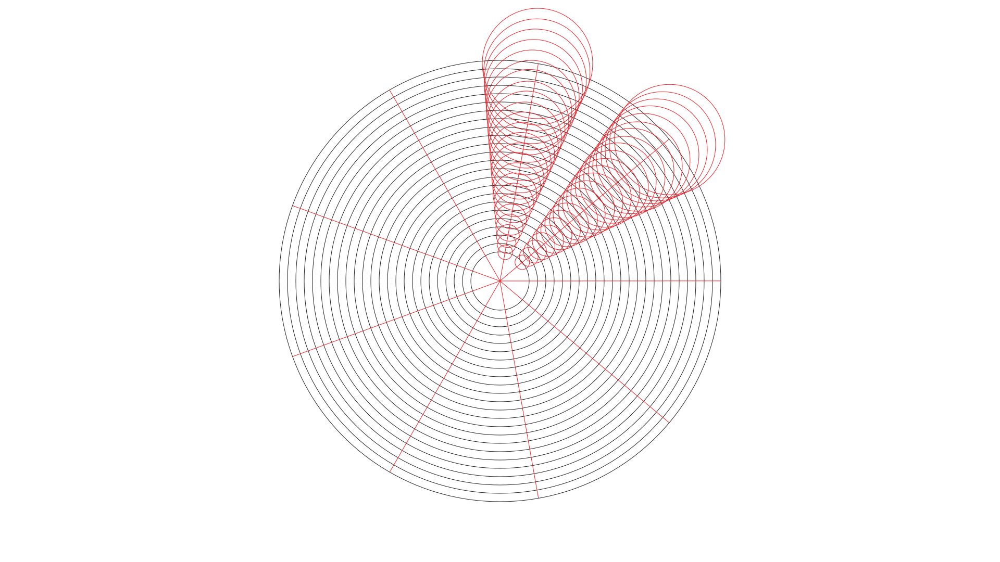
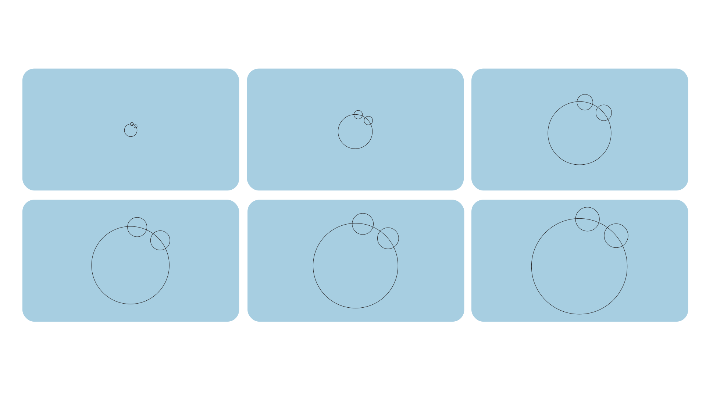

## Development Plan

### Design-First Approach

The development process started with the visual design of the application. Initial mockup was created in Illustrator to plan the layout, which allowed to visualize the final result and define precise dimensions and element positioning before starting development.

### 1. Main Circle Dimensions Calculation



Calculate possible dimensions for the main circle considering minimum margins from canvas edges:

- **Canvas**: 1920 × 1080px
- **Minimum margin**: 120px from all sides
- **Size constraints**: Multiple of 16, decreasing by step of 32
- **Algorithm**: aₙ = a₀ − 32·n
- **Valid sizes sequence**: 848 (1/4: 212), 816 (1/4: 204), 784 (1/4: 196), 752 (1/4: 188), 720 (1/4: 180), 688 (1/4: 172), 656 (1/4: 164), 624 (1/4: 156), 592 (1/4: 148), 560 (1/4: 140), 528 (1/4: 132), 496 (1/4: 124), 464 (1/4: 116), 432 (1/4: 108), 400 (1/4: 100), 368 (1/4: 92), 336 (1/4: 84), 304 (1/4: 76), 272 (1/4: 68), 240 (1/4: 60), 208 (1/4: 52), 176 (1/4: 44), 144 (1/4: 36), 112 (1/4: 28)px - 28 sizes total

### 2. Small Circles Intersection Verification



Verify that small circles placed on the main circle do not intersect:

- **Method**: Divide the main circle into equal parts
- **Maximum points**: 9 points on the circle
- **Small circle size**: 1/4 of main circle diameter
- **Result**: Confirmed that circles do not intersect with maximum 9 points distribution

### 3. Interactive Circle Generation

Implemented an interactive solution for adding circles dynamically.

## Scripts

- `npm run dev` - Start development server on port 3000

## Project Structure

```
src/
├── assets/                     # Static assets
├── components/
│   └── Component/
│       ├── index.tsx           # Component implementation
│       └── style.module.scss   # Component styles
├── styles/
│   ├── index.scss              # Main global styles
│   └── variables.scss          # Global CSS variables
├── App.tsx                     # Main application component
└── index.tsx                   # Application entry point
```
